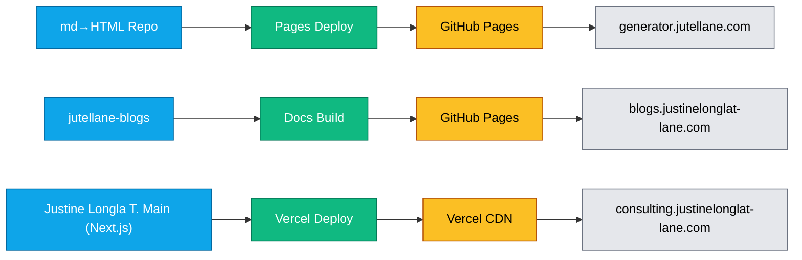

# JustineLonglaTe-Lane – Full Enhanced README


[](https://github.com/justine6/Justine Longla T.-Solutions/actions/workflows/ci.yml) 
[](https://codecov.io/gh/justine6/Justine Longla T.-Solutions)

<!-- CI/CD & Site Badges -->
[](https://github.com/justine6/Justine Longla T.-Solutions/actions/workflows/deploy.yml)
[](https://justinelonglat-lane.com)
[](https://github.com/justine6/Justine Longla T.-Solutions/commits/main)
[](https://justine6.github.io/jutellane-blogs/)

**Live site:** https://justinelonglat-lane.com

[](https://github.com/justine6/Justine Longla T.-Solutions/actions/workflows/preview-pr.yml)
[](https://github.com/justine6/Justine Longla T.-Solutions/actions/workflows/deploy-prod.yml)
[](https://github.com/justine6/Justine Longla T.-Solutions/actions/workflows/verify-production.yml)
[](https://github.com/justine6/Justine Longla T.-Solutions/actions/workflows/docs-pages.yml)

---

# 🧩 JustineLonglaTe-Lane  CI/CD & Documentation Status


[](https://github.com/justine6/Justine Longla T.-Solutions/releases/latest)

---

> **Automated pipelines for changelog preparation, version tagging, release publication, and production verification.**
>
> This repository follows a fully automated CI/CD process:
> - 🪄 **Prepare Workflow** – Generates and opens changelog PRs  
> - 🚀 **Release Workflow** – Cuts new versions, tags, and publishes releases  
> - 🔍 **Verify Production** – Validates deployments and production builds  
> - 📘 **Docs Workflow** – Builds and verifies documentation automatically on every push  

---

## 🌐 JustineLonglaTe-Lane  — Live Domains Overview

| Subdomain | Purpose | Hosting | Deployment | HTTPS |
|----------|----------|---------|------------|--------|
| **consulting.justinelonglat-lane.com** | Business site + services | Vercel | Main branch | ✅ |
| **blogs.justinelonglat-lane.com** | DevOps & Engineering Blog | GitHub Pages | jutellane-blogs repo | ✅ |
| **generator.jutellane.com** | Markdown → HTML static generator | GitHub Pages | md-to-html-static repo | ✅ |

---

## 🧩 Tech Stack Summary

- **Hosting:** Vercel + GitHub Pages  
- **CI/CD:** GitHub Actions (build, preview, deploy, verify, docs)  
- **Automation:** PowerShell (`Cut-Release.ps1`, `Generate-Changelog.ps1`)  
- **Frontend:** Next.js, TailwindCSS  
- **Docs:** MDX, custom static generators  
- **DNS:** Managed via IONOS  

---

## 🗺️ Architecture & Deployment Flow



---

## ✅ Uptime / Health Status

- Generator: 
- Blogs: 
- Projects: 

---

# 🚀 JustineLonglaTe-Lane  – Automated Release Workflow

This system manages automated changelog creation, semantic versioning, release publication, and verification.

---

## 🧩 Overview

### Stages:
1. **Prepare Stage**
2. **Release Stage**

### Tools:
- PowerShell
- GitHub CLI
- Git
- Semantic Versioning

---

## 📂 Key Files

| File | Description |
|------|-------------|
| `Cut-Release.ps1` | Orchestrates prepare + release stages |
| `scripts/Generate-Changelog.ps1` | Builds changelog |
| `CHANGELOG.md` | Version history |
| `WORKFLOW.md` | CI/CD documentation |

---

## 🧭 Usage

### Prepare:
```pwsh
pwsh -File .\Cut-Release.ps1 -Stage prepare -Bump auto -Yes
```

### Release:
```pwsh
pwsh -File .\Cut-Release.ps1 -Stage release -Yes
```

---

# ✅ Recent Updates (v2.5.0)

### Enhancements:
- ✅ Cal.com integration with fallback  
- ✅ Responsive layout polished  
- ✅ Auto-release + version tagging  
- ✅ MDX pipeline enhanced  
- ✅ Intro Call CTA finalized  

---

# 🔁 Restore Point

Tag: `restore/2025-11-09-brochure-fix`

Restore:
```bash
git fetch --tags
git checkout restore/2025-11-09-brochure-fix
```

---

# 🛠 Maintained By

**Longla Justine Tekang**  
🌍 https://justinelonglat-lane.com  
📧 justinelongla@yahoo.com  
## Reference States

- **ref/2025-11-15-branding**  
  Baseline branding for JustineLonglaT:
  - Hero uses profile photo in “Why Work With Me”
  - Latest Publications cards use `/brand/justine-logo.png`
  - Hire Me + Intro Call routing fixed
  - Brochure + Résumé PDFs working from footer
  _Deployment sanity check – Justine, 11/19/2025._
  <!-- sanity auto-deploy test - Justine, 11/19 -->
  <!-- auto deploy test -->
  
