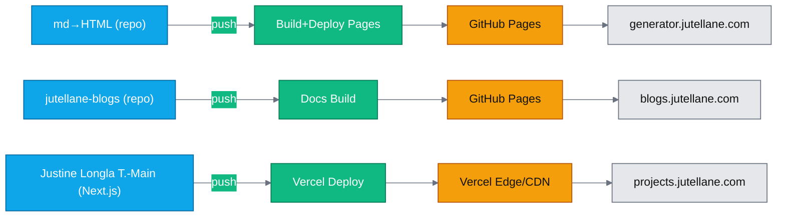

# 🧭 Justine Longla T.—Lane Full Architecture & Deployment Flow

Explore how Justine orchestrates automation across multiple repositories and live domains.  
The system ensures end‑to‑end CI/CD linkage, where each repo serves a unique deployment target — docs, main apps, and sub‑domains — all unified under a single architecture.

This diagram visually represents the entire deployment chain. It’s ideal for embedding in blog posts or internal documentation.
