# 🧭 Justine Longla T.—Lane Full Architecture & Deployment Flow

Explore how Justine orchestrates automation across multiple repositories and live domains.  
The system ensures end‑to‑end CI/CD linkage, where each repo serves a unique deployment target — docs, main apps, and sub‑domains — all unified under a single architecture.

```mermaid
%%{init: {
  "theme": "base",
  "themeVariables": {
    "background": "transparent",
    "primaryColor": "#0ea5e9",
    "primaryTextColor": "#ffffff",
    "primaryBorderColor": "#0369a1",
    "secondaryColor": "#10b981",
    "secondaryTextColor": "#ffffff",
    "secondaryBorderColor": "#047857",
    "tertiaryColor": "#f59e0b",
    "tertiaryTextColor": "#111111",
    "tertiaryBorderColor": "#b45309",
    "lineColor": "#6b7280",
    "textColor": "#111111"
  }
}}%%
flowchart LR
    classDef repo fill:#0ea5e9,stroke:#0369a1,color:#fff,stroke-width:1.2px;
    classDef actions fill:#10b981,stroke:#047857,color:#fff,stroke-width:1.2px;
    classDef host fill:#f59e0b,stroke:#b45309,color:#111,stroke-width:1.2px;
    classDef dns fill:#e5e7eb,stroke:#6b7280,color:#111,stroke-width:1.2px;

    A1["md→HTML (repo)"]:::repo -->|push| B1["Build+Deploy Pages"]:::actions --> C1["GitHub Pages"]:::host --> D1["generator.jutellane.com"]:::dns
    A2["jutellane-blogs (repo)"]:::repo -->|push| B2["Docs Build"]:::actions --> C2["GitHub Pages"]:::host --> D2["blogs.jutellane.com"]:::dns
    A3["Justine Longla T.-Main (Next.js)"]:::repo -->|push| B3["Vercel Deploy"]:::actions --> C3["Vercel Edge/CDN"]:::host --> D3["projects.jutellane.com"]:::dns
```

This diagram visually represents the entire deployment chain. It’s ideal for embedding in blog posts or internal documentation.
